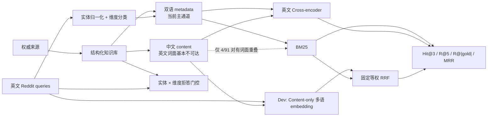

# Plant RAG：可追溯、分维度、可评测的植物知识检索

这个项目不试图做一个泛化的“植物 ChatGPT”，而是用 3 种常见室内植物构建一个小而完整的 RAG 工程闭环：权威来源进入结构化知识库，真实用户问题经过实体归一化与维度识别，再用冻结的 gold set 评测检索、拒答和边界行为。

当前阶段不依赖向量数据库。核心研究问题已经得到回答：**在实体过滤后的候选集上加入预测维度过滤，Recall@|gold| 从 57.3% 提高到 71.0%，按未四舍五入值计算提升 13.6 个百分点。** 语言审计随后发现正文通道几乎没有英文词面可达性；多语 embedding 在 dev 将 content-only R@5 从 5.0% 提高到 71.3%，并在一次冻结 test 上复现为 15.0%→65.4%。

## 技术结论

- **当前真正工作的检索主通道是 metadata。** 91 个 query–gold 对中有 84 个是 metadata-only，中文正文单独提供词面信号的对数为 0。
- **跨语言语义召回在冻结 test 上复现。** Content-only BGE-M3 的 R@5 为 65.4%、命中 26/46 个 gold pair，正分 content-only BM25 为 15.0%、3/46；dev 的对应结果为 71.3%/26/45 与 5.0%/1/45。
- **简单 RRF 没有稳定吃到通道互补性。** Test 上 metadata BM25 与 BGE 的 pair 并集为 34，等权 RRF 仍为 32/46；R@5 78.3%→77.1%，但 Hit@3 85.0%→95.0%、R@|gold| 48.3%→58.3%，因此不能概括成全面提升或全面失败。
- **结构化维度过滤是主效应。** 完整集 N=40 上，实体过滤 BM25 的 Recall@|gold| 为 57.3%，召回优先的预测维度将其提高到 71.0%。
- **维度分类器已经接近当前上界。** 分类器 micro-F1 为 95.9%；预测维度与人工 oracle 维度仅相差 1.25pp Recall@|gold|，继续调 prompt 的收益有限。
- **rerank 未在当前规模上表现出稳健收益。** 完整集 Recall@|gold| 为 71.0%→72.8%，但 R@5 为 87.6%→86.8%；排除全部 thread-context 后，+0.8pp Recall@|gold| 只来自一条 query，不能作为稳定提升结论。
- **系统边界被保留而非隐藏。** `q:main:031` 缺失帖子中的植物实体，cross-encoder 后第一条 gold 仍只排第 6；它保留在完整表和 case study 中，并与其他 thread-context 样本按统一规则进入排除视图。

## 语言审计揭示：当前主通道是 metadata

这是英文 query 检索中文事实正文。为了判断 BM25 究竟在检索什么，实际索引被拆成中文 `content` 与 dimension/topics/conditions/retrieval metadata，并使用与 baseline 完全相同的 tokenizer 审计 91 个 query–gold 对。

| 词面可达类型 | query–gold 对数 | 占比 |
|---|---:|---:|
| metadata 有重叠 | 88/91 | 96.7% |
| 中文正文有重叠 | 4/91 | 4.4% |
| 仅 metadata | 84/91 | 92.3% |
| metadata 与正文都有 | 4/91 | 4.4% |
| 仅正文 | 0/91 | 0.0% |
| 两者都无 | 3/91 | 3.3% |

按 query–gold 对内去重后再累加，metadata 提供 282 个重叠 token，正文只有 5 个。由此可以更准确地描述当前系统：**它是结构化字段检索，加上一条在英文 query 下基本不可达的中文正文通道。**

这条证据把六档结果连成一条一致的诊断链：

1. BM25 的英文词面信号几乎全部来自 metadata；
2. 实体和维度过滤继续强化这个有效通道，因此维度过滤产生 +13.6pp 主效应；
3. cross-encoder 输入包含正文与 metadata，但所用模型在英文 MS MARCO passage ranking 上训练，无法稳定利用中文正文，因此没有表现出稳健收益；
4. dev 与一次冻结 test 都验证了跨语言语义召回能激活正文；两边也都显示简单 RRF 未扩大 pair 命中集合，瓶颈已定位到稳健融合而非正文可达性。

这仍是描述性通道审计，不是随机化因果实验；它能证明正文缺少词面可达性，并为弱 rerank 结果提供直接数据支撑，但不能单独量化“语言错配造成了多少指标损失”。完整逐对结果见 [`evaluation/results/index_language_overlap.json`](evaluation/results/index_language_overlap.json)。

## Dev 语义召回：正文通道已被激活

本节只使用哈希切分的 dev 20 条（45 个 query–gold 对）；模型选择时 test 没有被编码或评测。31 条知识仍是一条 entry 一个 chunk，不做二次切分；content-only 方法只索引中文 `content`，不使用实体、维度或其他 metadata。

| 方法 | Content-only 宏 R@5 | Metadata + content 宏 R@5 |
|---|---:|---:|
| BM25 | 5.0% 正分信号 / 22.5% 强制补满 Top-5 | 70.1% |
| BGE-M3 dense embedding | 71.3% | — |
| Multilingual-E5-large dense embedding | 69.7% | — |
| BM25 + BGE-M3 等权 RRF | — | 75.1% |

Content-only BM25 使用 baseline 同款 tokenizer：NFKC、casefold、ASCII token 与轻量英文词干；中文连续字符序列保留整串并生成重叠二元组，不使用 jieba 或其他分词器。强制 Top-5 会用 entry ID 顺序填入零分候选，因此 22.5% 含偶然命中；只保留 `score > 0` 后，宏 R@5 和 R@|gold| 都是 5.0%，只命中 1/45 个 gold pair。

| Dev N=20 | Hit@3 | 宏 R@5 | 宏 R@\|gold\| | Gold pair@5 |
|---|---:|---:|---:|---:|
| Content-only BM25，正分候选 | 5.0% | 5.0% | 5.0% | 1/45 |
| Content-only BM25，强制 Top-5 | 10.0% | 22.5% | 11.3% | 7/45 |
| Content-only BGE-M3 | 80.0% | 71.3% | 52.6% | 26/45 |
| Content-only multilingual-E5-large | 75.0% | 69.7% | 39.7% | 26/45 |
| Metadata + content BM25 | 85.0% | 70.1% | 57.6% | 26/45 |
| BM25 + BGE-M3，固定等权 RRF | 85.0% | 75.1% | 59.7% | 26/45 |

BGE-M3 按预注册的 content-only 宏 R@5 机械胜出，但只领先 E5 1.7pp，且两者同为 26/45 pair 命中；这不足以宣称 BGE 在总体上优于 E5。BGE 按官方说明不加 instruction，E5 按官方说明加入 `query:` / `passage:` 前缀，因此这是遵循各自协议的比较，不是完全相同输入条件。选择结果只决定冻结 test 使用 BGE-M3。

两个通道有真实互补性：BM25 与 BGE-M3 各命中 26/45 个 Top-5 gold pair，其中只有 19 个重合，各自独有 7 个，并集为 33 个。固定 RRF 仍只保留 26 个，但把 dev 宏 R@5 从 70.1% 提高到 75.1%、R@|gold| 从 57.6% 提高到 59.7%；说明正文通道已被激活，但当前无调参融合没有吃完互补上界。单轮 dev 只有 n=15，RRF 的 R@5 为 75.7%→85.7%，只能作为方向性证据。

模型、前缀、chunk、选型指标和 RRF 在运行前冻结于 [`evaluation/experiments/semantic_retrieval_v1.json`](evaluation/experiments/semantic_retrieval_v1.json)；完整逐 query 结果见 [`evaluation/results/semantic_retrieval_dev.json`](evaluation/results/semantic_retrieval_dev.json)，SHA-256 为 `c071ff51e2a4ccbb6e2895f4ff34c23685d67ad113e287c00ce0d234d7c4e66d`。

## 一次冻结 test：正文激活复现，融合收益分化

进入 test 前只做了一次预注册的权重扫描：固定 BM25 权重 1.0、RRF `k=60`，扫描 BGE 权重 `0.50/0.75/1.00/1.25/1.50`。停止条件写为“最佳 pair 命中 ≤28/45 就保留等权 RRF”。最佳权重 0.50 恰为 28/45，因此按规则回退到 1.0/1.0，不补扫权重。配置与结果分别见 [`fusion_weight_sweep_v1.json`](evaluation/experiments/fusion_weight_sweep_v1.json) 和 [`fusion_weight_sweep_dev.json`](evaluation/results/fusion_weight_sweep_dev.json)。

最终配置冻结了 BGE revision、tokenizer、31 条全量候选、一条知识一个 chunk、`RRF k=60` 和等权参数，随后只运行一次 test：

| Test N=20 | Hit@3 | 宏 R@5 | 宏 R@\|gold\| | Gold pair@5 |
|---|---:|---:|---:|---:|
| Content-only BM25，正分候选 | 15.0% | 15.0% | 15.0% | 3/46 |
| Content-only BGE-M3 | 80.0% | 65.4% | 49.2% | 26/46 |
| Metadata + content BM25 | 85.0% | 78.3% | 48.3% | 32/46 |
| BM25 + BGE-M3，冻结等权 RRF | 95.0% | 77.1% | 58.3% | 32/46 |

正文激活结论得到复现：content-only R@5 提高 50.4pp，pair 命中从 3/46 到 26/46。融合结论则必须拆开读：BM25 与 BGE 分别命中 32/46 和 26/46，重合 24，并集 34；等权 RRF 仍为 32/46。它改善首部排序和按 gold 数截断的完整度，却让宏 R@5 下降 1.25pp，说明简单融合的收益依赖指标、并不稳健。

冻结配置见 [`semantic_retrieval_final_v1.json`](evaluation/experiments/semantic_retrieval_final_v1.json)，SHA-256 为 `390ddd35f804a59d967d6ff3a9eea24bcacc3dde35bf80c4fd5b33fa4c60aeb1`；test 结果见 [`semantic_retrieval_test.json`](evaluation/results/semantic_retrieval_test.json)，SHA-256 为 `0f0056e165c1e3e3dca8c6f179123f89974b906ae006e819ec5c945ef58e082a`。一次性运行记录保存在 [`semantic_retrieval_test_run_v1.json`](evaluation/results/semantic_retrieval_test_run_v1.json)。

## 六档检索实验

配置：31 条知识、40 条有 gold 的英文 Reddit query、`K=3`。Recall@|gold| 表示每条 query 取自身 gold 数量作为 K 后计算召回，再对 query 做宏平均；R@5 同样是逐 query 宏平均。

报告同时保留两个预先定义的人群：

- **完整视图 N=40**：不隐藏上下文不足样本；
- **单轮视图 N=30**：统一排除全部 10 条 `context_requirement=thread_context`。它仍包含 7 条 image-context，因此不是“纯文本信息充分集”。

| 检索阶段 | 完整 Hit@3 | 完整 R@5 | 完整 R@\|gold\| | 单轮 Hit@3 | 单轮 R@5 | 单轮 R@\|gold\| |
|---|---:|---:|---:|---:|---:|---:|
| BM25 | 85.0% | 74.2% | 53.0% | 86.7% | 78.4% | 55.1% |
| + 实体过滤 | 90.0% | 81.9% | 57.3% | 93.3% | 88.7% | 60.9% |
| + 预测维度 | 97.5% | 87.6% | 71.0% | 100.0% | 95.2% | 79.1% |
| + oracle 维度 | 97.5% | 90.1% | 72.2% | 100.0% | 96.8% | 79.1% |
| + 预测维度 + cross-encoder | 92.5% | 86.8% | 72.8% | 96.7% | 96.0% | 79.9% |
| + oracle 维度 + cross-encoder | 92.5% | 89.8% | 75.8% | 96.7% | 98.3% | 82.2% |

这张表支持三个层次不同的结论：

1. 实体约束和维度约束分别提供独立增益，其中维度过滤是最大的单一效果。
2. 预测维度已接近 oracle，意图识别不再是主要瓶颈。
3. 英文 cross-encoder 改变了排序，但同时制造反例：`q:main:025` 的 gold 从第 3/5 移到第 4/5，R@5 不变而 Hit@3 失败。当前只能说 rerank 的收益不稳健。

完整逐 query 排名、候选分数和双视图指标见 [`evaluation/results/rerank_ablation.json`](evaluation/results/rerank_ablation.json)，解释性分析见 [`evaluation/results/gap_analysis.md`](evaluation/results/gap_analysis.md)。

## 当前实际检索结构



### 知识库

- 3 个实体：龟背竹、绿萝、虎尾兰；
- 31 条原子知识，覆盖 taxonomy、lighting、watering、humidity、temperature、symptom、pet_safety；
- 16 个来源，每条知识必须包含 `source_id` 和可定位的 locator；
- 22 条别名，区分接受名、历史异名、俗名以及不可自动映射的歧义词；
- pet safety 强制至少两个来源，并保留来源页面使用的学名与接受名之间的对应关系。

知识 schema、来源规则和数据说明见 [`knowledge_base/README.md`](knowledge_base/README.md)。

### 评测集

- 40 条真实英文用户提问，按 A 直接属性、B 别名/指代、C 症状、D 复合条件、E 判断/前提分列；
- 10 条独立拒答集，覆盖库外植物、缺失维度和证据不足；
- 每条 query 标注 `expected_dimensions`、`gold_entry_ids`、`answer_shape`、覆盖状态和上下文需求；
- 多原因症状允许多个 gold，避免用“命中任意一条”掩盖鉴别覆盖不足；
- 结构化拒答采用实体门控和 `(plant_id, dimension)` 覆盖门控，不把拒答简化为相似度阈值。

字段定义和指标口径见 [`evaluation/README.md`](evaluation/README.md)。

## 实验可信度不是事后补充

这个项目保留了三类会让结果“没那么漂亮”、但更可信的证据：

1. **预先停止条件。** 召回优先 prompt 只允许迭代一次；预先约定 R@5 超过 87% 就停止，实际为 87.6%，因此没有继续围绕 40 条测试 query 调 prompt。
2. **一致性检查改变了排除方案。** 原计划只排除 `q:main:031`，但全量审计发现共有 10 条 thread-context，D 列还包括 `035`、`036`。最终放弃更有利的 D n=8，只报告完整 n=9 和统一规则下的单轮 n=6。schema 与 validator 强制 `excluded_from_single_turn=true` 当且仅当 `context_requirement=thread_context`。
3. **模型和结果已冻结。** Cross-encoder revision 为 `233902d25c440f23af6f7d6e94d2946bac0bee0a`，关键依赖版本记录在结果 JSON；`rerank_ablation.json` 的 SHA-256 为 `782b27cfb437f0b520f0706ff1150c86113074ab380696eee7b9ee0b7b16305e`。

此外，测试同时保留 negative result：单轮 rerank 的 +0.8pp Recall@|gold| 只来自 `q:main:033` 一条，不能写成总体方法提升。

## 可复现运行

基础校验和词法实验只需要 Python 标准库：

```bash
python3 scripts/validate_kb.py
python3 scripts/validate_evaluation.py
python3 scripts/evaluate_baseline.py --k 3
python3 scripts/evaluate_oracle.py --k 3
python3 scripts/analyze_index_language_overlap.py
python3 scripts/create_evaluation_split.py
python3 scripts/evaluate_dimension_ablation.py \
  --predictions evaluation/results/dimension_predictions_recall.json \
  --output evaluation/results/dimension_ablation_recall.json \
  --k 3
python3 -m unittest discover -s tests -v
```

维度预测文件已经冻结，日常复现不会重新调用 LLM。若需要生成新预测，单独运行 `scripts/classify_dimensions.py`，并把新版本与当前测试结果隔离。

重跑 cross-encoder：

```bash
python3 -m venv .venv
.venv/bin/pip install -r requirements-rerank.txt
.venv/bin/python scripts/evaluate_reranker.py \
  --predictions evaluation/results/dimension_predictions_recall.json \
  --output evaluation/results/rerank_ablation.json \
  --model cross-encoder/ms-marco-MiniLM-L6-v2 \
  --k 3
shasum -a 256 evaluation/results/rerank_ablation.json
```

重跑 dev 语义召回（不会运行 test）：

```bash
HF_HOME=/path/to/model-cache .venv/bin/python \
  scripts/evaluate_semantic_retrieval.py \
  --split dev \
  --output evaluation/results/semantic_retrieval_dev.json
```

当前共有 21 项单元测试，覆盖知识引用、宠物安全双来源、接受名/异名映射、评测分母、排除规则、oracle 标签完整性、prompt 泄漏检查、索引语言审计、content-only BM25 地板、test gate、确定性 dev/test 切分、预注册融合停止条件和冻结 test 指标。

## 项目结构

```text
knowledge_base/
  data/                 # plants、sources、aliases、31 条知识
  schemas/              # 实体、来源、别名和知识条目 schema
evaluation/
  data/                 # 40 条主集 + 10 条拒答集
  experiments/          # 运行前冻结的语义召回配置
  splits/               # label-blind SHA-256 dev/test manifest
  schemas/              # query schema
  results/              # baseline、oracle、消融、rerank、semantic、case study
scripts/
  validate_*.py         # 结构与内容校验
  evaluate_*.py         # baseline、oracle、dimension、rerank、semantic
  classify_dimensions.py
tests/
```

## Dev/test 已在模型实验前冻结

40 条主集已经用不读取文本、标签或指标的稳定规则切成 20/20：计算无盐 `SHA-256(query_id)`，按十六进制摘要升序排列，前 20 条进入 dev，其余进入 test。成员、哈希、算法、源数据指纹和分布保存在 [`evaluation/splits/main_sha256_20_20_v1.json`](evaluation/splits/main_sha256_20_20_v1.json)。

| 分布 | dev | test |
|---|---:|---:|
| 总 query | 20 | 20 |
| thread-context | 5 | 5 |
| partial | 5 | 5 |
| A/B/C/D/E | 6 / 2 / 3 / 4 / 5 | 5 / 4 / 3 / 5 / 3 |
| 龟背竹 / 绿萝 / 虎尾兰 / null | 7 / 8 / 4 / 1 | 4 / 5 / 11 / 0 |

哈希切分刻意不做事后分层或人工换样本，因此植物分布不平衡。除 aggregate 外仍检查 per-plant 指标；但 dev 中虎尾兰只有 4 条，一条即 25pp，**per-plant 指标只用于发现全军覆没等系统性失败，不用于比较模型优劣。** 模型、chunk 和融合权重只看 dev，test 已在方案冻结后运行一次且不再重跑。split manifest 的 SHA-256 为 `e1f4e825662896e8c752a6d8e72007650b10f82c9146d8af751affe4fe34ae47`。

## 局限与封版状态

当前结果是描述性工程实验，不证明维度过滤或 rerank 在更大语料上具有相同效应。主要限制包括：仅 40 条英文 query；D 列完整/单轮分别只有 9/6 条；单轮视图仍含 image-context；KB 正文与 query 存在中英语言错配；当前数据不能评测真正的多轮指代继承。

本轮已经封版：不增加第三个 embedding 模型，不继续调 RRF 权重或 `k`，不依据 test 修改方案，也不重跑 test。若未来开启新实验，应建立新版本配置和新评测集，而不是覆盖本轮结果。

语义召回的初始选型、融合扫描和最终 test 配置分别保存在 [`semantic_retrieval_v1.json`](evaluation/experiments/semantic_retrieval_v1.json)、[`fusion_weight_sweep_v1.json`](evaluation/experiments/fusion_weight_sweep_v1.json) 和 [`semantic_retrieval_final_v1.json`](evaluation/experiments/semantic_retrieval_final_v1.json)。

## 简历项目描述

> 构建可追溯的植物养护 RAG 检索系统：将 16 个权威来源整理为 31 条原子知识与 22 条实体别名，设计 40 条真实 query、10 条拒答 query 和多 gold 评测集；实现实体归一化、结构化拒答和 few-shot 多标签维度路由，使 Recall@|gold| 从实体过滤 BM25 的 57.3% 提升至 71.0%（+13.6pp）。索引审计发现 91 个 query–gold 对中 84 个仅靠 metadata 建立词面信号；多语 embedding 将 content-only R@5 在 dev 从 5.0% 提高到 71.3%，并在一次冻结 test 上复现 15.0%→65.4%。预注册融合扫描触发停止条件，最终 test 显示等权 RRF 的 R@5 不升反降 1.25pp，但 Hit@3 与 R@|gold| 分别提高 10.0pp，负结果与指标分离均如实保留。
